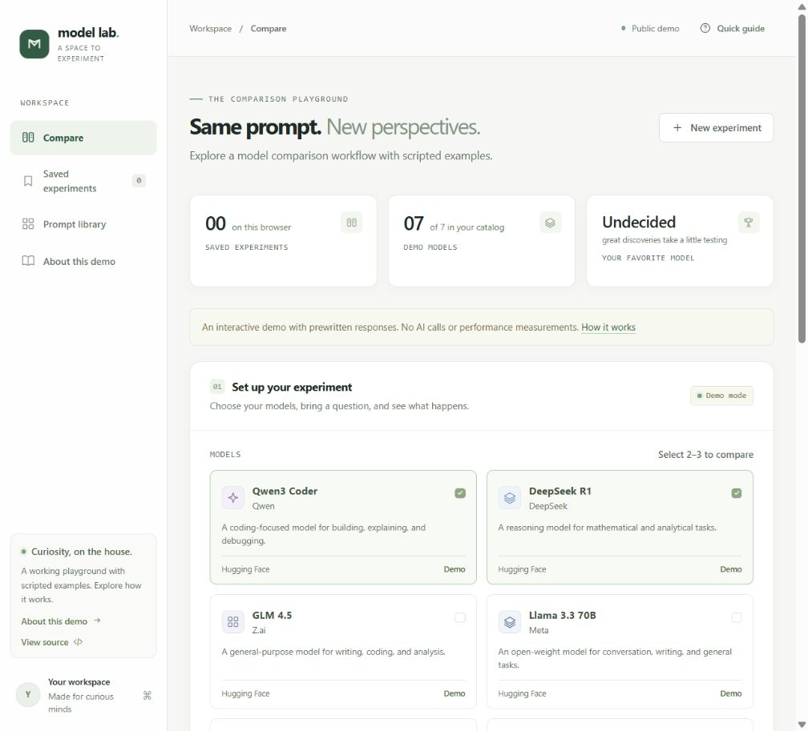

# AI Model Lab

A small AI model comparison app built to learn, demonstrate in a portfolio, and develop into a hosted product. Give multiple models the same prompt, compare their responses, rate the results, and keep a history of your experiments.

Built by [Molham Alam](https://www.molham.tech/) with vanilla JavaScript and Node.js. The public version is an explicitly labelled scripted demo; running the project locally enables real inference with your own provider keys.

[Live demo](https://ai-model-lab-ruby.vercel.app/) · [Portfolio](https://www.molham.tech/) · [Source code](https://github.com/Molham-arch/ai-model-lab)



## What you can explore

- Seven model choices across Hugging Face, OpenAI, and Google Gemini.
- Side-by-side comparisons of two or three responses, with ratings and a personal winner.
- Provider-reported tokens, response time, and optional cost estimates in local live mode.
- A browser notebook with JSON export and a responsive, keyboard-accessible interface.
- Server-side credentials, independent provider errors, and automated API and client checks.

The app starts in **demo mode when no provider keys are set**. It makes no inference API calls and has no API cost. Demo responses are scripted examples; speed, tokens, and cost are shown as unavailable rather than filled with fake measurements. Connect Hugging Face, OpenAI, or Google when you are ready to run real prompts.

## Start the app

You need a current Node.js release, version **22.9 or newer**. There are no third-party npm dependencies to install.

From the project folder, run:

```sh
npm start
```

Then open **http://localhost:3000** in your browser. Keep the terminal running while you use the app. Press `Ctrl+C` to stop it.

On Windows, you can also run `start.cmd`. It uses the local `.tools/node/node.exe` runtime if available, then falls back to Node.js on your PATH.

If PowerShell blocks `npm.ps1`, use `npm.cmd start`, or run Node directly:

```sh
node --env-file-if-exists=.env server.mjs
```

## Try your first comparison

1. Choose a prompt preset, or write your own prompt.
2. Select two or three models and click **Run comparison**.
3. Read their answers side by side. Live comparisons also show response time and provider token counts when available.
4. Rate useful answers, optionally pick a winner, and click **Save experiment**.
5. Open **Saved experiments** to revisit your work, or use **Export** to download JSON.

The notebook holds up to 50 saved experiments. Saved comparisons and ratings stay in this browser's local storage. They are not shared between browsers or devices. Clearing browser data removes them, so export experiments you want to keep. Changes to ratings or winners on an already saved experiment are saved automatically.

## Connect real AI models

The catalog includes seven model slots. Compare any two or three enabled models at a time:

| Default model | Connection | Key in `.env` |
| --- | --- | --- |
| Qwen3 Coder | Hugging Face | `HF_TOKEN` |
| DeepSeek R1 | Hugging Face | `HF_TOKEN` |
| GLM 4.5 | Hugging Face | `HF_TOKEN` |
| Llama 3.3 70B | Hugging Face | `HF_TOKEN` |
| GPT-OSS 20B | Hugging Face | `HF_TOKEN` |
| GPT-5 mini | OpenAI API | `OPENAI_API_KEY` |
| Gemini 3.8 Flash | Google Gemini API | `GEMINI_API_KEY` |

1. If you do not already have a `.env` file, copy `.env.example` in the project folder. In PowerShell:

   ```powershell
   Copy-Item .env.example .env
   ```

2. Add the key for each provider you want to use. For Hugging Face, use a token with **Make calls to Inference Providers** permission. An existing `HF_TOKEN` also enables the new Llama and GPT-OSS slots. Check [supported Hugging Face models](https://huggingface.co/inference/models).
3. For direct GPT-5 mini or Gemini, create separate OpenAI or Google API keys and set `OPENAI_API_KEY` or `GEMINI_API_KEY`. See the [GPT-5 mini model documentation](https://developers.openai.com/api/docs/models/gpt-5-mini) and [Gemini API setup](https://ai.google.dev/gemini-api/docs/openai). GPT-OSS is an open-weight model served through Hugging Face in this app; it does not use the OpenAI API key.
4. Restart the server and refresh the browser. Any configured key switches the app to **Live inference** automatically. Only models for providers with a key can be selected. Clicking a **Needs API key** card opens **Settings** for setup.

At least two enabled model slots are needed for a comparison. `HF_TOKEN` enables five slots; to compare the two direct provider slots, configure both OpenAI and Gemini keys.

To return to the no-cost demo, clear all three keys in `.env`, restart the server, and refresh the browser. Remove any copies set in your shell or operating-system environment too. Live model availability, access, quotas, and billing depend on each account and provider; a configured key does not guarantee access or free usage.

The server reads keys from its environment. The browser never receives them. `.env` is excluded from Git; do not paste keys into frontend files, screenshots, exported results, or commits.

### Model configuration

You can customize the seven model slots in `.env`:

| Variable | Purpose |
| --- | --- |
| `HF_TOKEN`, `OPENAI_API_KEY`, `GEMINI_API_KEY` | Server-side provider credentials; all blank means demo mode |
| `HF_MODEL_1` through `HF_MODEL_5` | Model identifiers sent to the Hugging Face router |
| `HF_MODEL_1_NAME` through `HF_MODEL_5_NAME` | Optional Hugging Face model display names |
| `OPENAI_MODEL`, `OPENAI_MODEL_NAME` | Direct OpenAI model ID and display name; default `gpt-5-mini` |
| `GEMINI_MODEL`, `GEMINI_MODEL_NAME` | Direct Google model ID and display name; default `gemini-3.8-flash` |
| `<PREFIX>_INPUT_USD_PER_MILLION`, `<PREFIX>_OUTPUT_USD_PER_MILLION` | Optional paired rates; prefix is `HF_MODEL_1` through `HF_MODEL_5`, `OPENAI_MODEL`, or `GEMINI_MODEL` |
| `PORT` | Local HTTP port; defaults to `3000` |
| `HOST` | Network interface; defaults to `127.0.0.1` for local use |
| `APP_ORIGIN` | Optional permitted HTTP(S) origin; required for browser access on a non-local host |
| `PUBLIC_DEMO` | Set to `true` to ignore provider keys and expose the scripted public demo; Vercel always enables this mode |

Restart the server after changing configuration. A model appearing in the interface does not guarantee that a provider is currently serving it. Check the relevant provider's documentation if a live request fails.

For cost estimates, enter your actual provider's input and output prices in USD per million tokens. Both rates must be finite numbers greater than or equal to zero; an incomplete or invalid pair prevents startup. Rates default to blank and are never fetched or guessed automatically. The app calculates an estimate only for live results that include both input and output token counts. Caching, discounts, and provider billing rules can make the final charge different.

The output budget is capped at 4,096 tokens per model. Some models spend part of this budget on reasoning, leaving fewer tokens for the visible answer. This app requests low reasoning effort for GPT-5 and Gemini 3 models and omits temperature for GPT-5. If an answer is cut short, try a simpler prompt or a larger budget within the cap. See OpenAI's [reasoning token guide](https://developers.openai.com/api/docs/guides/reasoning) for how reasoning can affect output limits.

## How it works

```text
Browser: prompt, comparison UI, ratings, local history
    |
    | HTTP requests to this app
    v
Node.js server: static files, validation, model calls
    |
    | Live mode only; keys stay here
    v
Hugging Face router, OpenAI API, or Google Gemini API
```

| File or folder | Role |
| --- | --- |
| `public/` | The browser interface, styles, and client logic |
| `server.mjs` | The local web server and API |
| `tests/server.test.mjs` | API and security checks using Node's built-in test runner |
| `tests/client.test.mjs` | Client utility and stored-data safety checks |
| `tests/integration.test.mjs` | Shipped assets and a three-model comparison/save round trip |
| `.env.example` | A safe template for server configuration |
| `start.cmd` | Windows launcher |
| `package.json` | Start and test commands |

The frontend uses vanilla HTML, CSS, and JavaScript. The server uses Node.js built-in modules and `fetch`. This keeps the project easy to inspect and avoids a build step.

## Run the checks

```sh
npm test
```

If you are using the bundled Windows runtime without a system Node.js installation, run this from the project folder in PowerShell:

```powershell
& ".\.tools\node\node.exe" --test
```

This runs Node's built-in test runner. Automated tests do not require a paid model request. To verify your own token and provider access, run a small live comparison in the interface.

For a quick manual check, run a demo comparison, rate a response, save it, refresh the page, reopen it, and export the JSON. Repeat at a narrow browser width to check the mobile layout.

## Learn from the project

1. Start in `public/` and trace how the prompt form renders results.
2. Follow a browser request into `server.mjs` to learn validation and server-side API calls.
3. Inspect the local-storage code to understand saving, loading, and deleting experiments.
4. Read the tests, then add a small feature such as a new prompt preset.
5. Run the app with a real token and compare how provider errors and model responses are handled.

For your portfolio, show a short comparison workflow and explain the choices: a key-free demo, server-side secrets, browser persistence, and honest metric labels. Include a screenshot and a brief account of what you learned.

## What the results mean

- **Demo mode:** responses are scripted, with speed, token counts, and cost unavailable. No API calls are made and no benchmark metrics are invented. Changing a prompt does not turn the demo into a real language model.
- **Live mode:** response time includes network and provider delay. It is not a controlled model-speed benchmark.
- **Tokens:** live token counts come from the provider when available; missing counts are shown as unavailable.
- **Costs:** estimates use your configured rates and reported token usage. Missing rates or counts leave cost unavailable. Your provider's usage dashboard is the source of truth for actual charges.
- **Ratings:** your own judgments help compare answers for a particular task. One experiment cannot establish which model is universally best.
- **Privacy:** live prompts go to the selected connection: Hugging Face and its inference provider, OpenAI, or Google. Saved history is stored locally in your browser, without application-level encryption.

## Deploy the public demo on Vercel

Import this GitHub repository into your Vercel account and deploy it using Node.js 24. The repository includes the deployment configuration. No provider keys are needed.

Vercel deployments always force **public demo mode**, even if provider keys are accidentally configured. Responses stay scripted, metrics stay unavailable, and no inference requests are made. The hosted About page explains how to run real comparisons locally. On other Node.js hosts, set `PUBLIC_DEMO=true`, `HOST=0.0.0.0`, and `APP_ORIGIN` to your HTTPS site origin. The host can supply `PORT`.

The `/api/health` endpoint supports GET and HEAD for health checks. GitHub Actions runs `npm test` on pushes and pull requests. Both `.gitignore` and `.vercelignore` exclude private environment files and local tooling.

Link the deployed app from your portfolio's project section. Frame embedding is intentionally disabled; use a normal Live demo link.

See [Vercel's Node.js server documentation](https://vercel.com/docs/functions/runtimes/node-js) for hosting details.

## Before enabling public live inference

This version does not include user accounts, payments, or a shared database. The local server binds to the loopback interface by default. Basic in-memory limits restrict each IP to 10 comparisons per minute and two concurrent comparisons, with six concurrent comparisons globally. These reset with the server and do not provide per-user budgeting or shared limits across multiple server instances. Behind a proxy, visitors may share the proxy's limit.

Before deploying live inference publicly, add authentication, per-user quotas and spending controls, durable database storage, and production rate limits. Decide how long to retain prompts, provide a way to delete user data, configure HTTPS and `APP_ORIGIN`, and store keys in your hosting platform's secret manager. Browser local storage is useful for a local prototype but is not a substitute for user accounts or durable storage.

The public demo lets visitors explore the workflow while those features remain future work.

## Troubleshooting

| Symptom | What to check |
| --- | --- |
| `node` or `npm` is not recognized | Install Node.js 22.9 or newer, then open a new terminal; on Windows try `start.cmd` if the bundled runtime is present |
| `--env-file-if-exists` is not recognized | Upgrade Node.js to a current release |
| Port 3000 is already in use | Set another `PORT` in `.env`, restart, and open that port |
| A model says it needs setup | Add that provider's key in `.env`, then restart the server and refresh the page |
| Fewer than two live models are selectable | Configure `HF_TOKEN` for five model slots, or enable another direct provider |
| A live model returns an error | Check token permissions, credits, provider availability, and the configured model ID |
| Every model immediately reports a blocked connection | The server may be running in a restricted coding environment without outbound network access. Stop that server and run `start.cmd` from a normal terminal, or grant network access to the server launch. |
| A saved comparison disappeared | Check that you are using the same browser, profile, and URL; private browsing and cleared site data do not preserve history |

## License

MIT. See [LICENSE](LICENSE).
